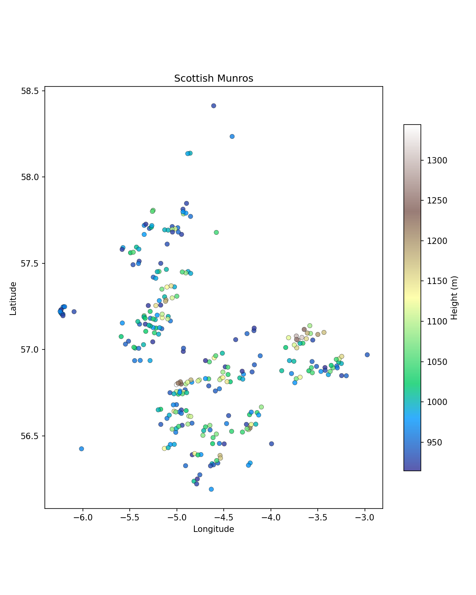

# Mapping Scottish Munros

A simple plotting exercise using `matplotlib` to visualise the geographic distribution of Scotland's 281 Munros (peaks over 914.4m / 3,000ft), coloured by elevation. The script reads coordinates and heights from a CSV and produces a scatter plot with a latitude-corrected aspect ratio so the output resembles the actual shape of Scotland.

## Data

The input data is a CSV file (`in/scottish_hills.csv`) containing 281 rows with the following columns:

| Column      | Description                            |
|-------------|----------------------------------------|
| Hill Name   | Name of the Munro                      |
| Height      | Height in metres                       |
| Latitude    | Decimal latitude (WGS84)               |
| Longitude   | Decimal longitude (WGS84)              |
| Osgrid      | Ordnance Survey grid reference         |

The dataset is freely available and is commonly used in introductory data science teaching. It can be found bundled with various online tutorials on `pandas` and `matplotlib`. A copy is included in the `in/` directory of this repository.

## Repo structure

```
in/
  └── scottish_hills.csv       # Input data
out/
  └── scottish_hills.png       # Generated plot
src/
  └── plot_scottish_hills.py   # Main script
setup.sh                       # Environment setup
requirements.txt               # Python dependencies
README.md
```

## Reproducing the analysis

### 1. Set up the virtual environment

The included `setup.sh` script creates a virtual environment and installs all dependencies:

```bash
bash setup.sh
```

This runs the following steps:

```bash
python3 -m venv env
source ./env/bin/activate
pip install -r requirements.txt
deactivate
```

### 2. Activate the environment

After setup, activate the environment before running any scripts:

```bash
source ./env/bin/activate
```

### 3. Run the script

```bash
python src/main.py
```

The script takes no command line arguments. All paths are resolved relative to the repository root, so it should be run from the top-level directory. The output is saved to `out/scottish_hills.png`.

### 4. Deactivate when finished

```bash
deactivate
```

## Summary of results

<p align="center">
  
</p>

The output plot shows the spatial distribution of all 281 Munros across the Scottish Highlands and Islands. A few things are immediately visible from the map:

- The densest cluster of peaks runs through the central Highlands, roughly between Glen Coe and the Cairngorms.
- A distinct isolated cluster appears to the far west — these are the Cuillin ridge peaks on the Isle of Skye.
- The Cairngorms and eastern Grampians form a secondary concentration to the east, and these tend to include some of the highest points (visible as lighter colours on the terrain colourmap).
- There are very few Munros in the far north, and none in the Southern Uplands or Lowlands — the dataset covers only the Highlands and Islands.

## Limitations and possible improvements

**Aspect ratio correction.** The plot applies a simple cosine correction to approximate the narrowing of longitude at ~57°N. This is adequate for a small region like Scotland but is not a true map projection. Using `cartopy` or `geopandas` with a proper projection (e.g. British National Grid, EPSG:27700) would be more rigorous and would also allow overlaying coastline or terrain shapefiles for geographic context.

**No basemap.** Without a coastline or terrain underlay, the plot relies on the viewer recognising the shape of Scotland from the point distribution alone. Adding a basemap (via `contextily` or `cartopy`) would make the output more immediately interpretable.

**Static output.** The plot is a static PNG. An interactive version (e.g. using `plotly` or `folium`) would let users hover over individual points to see hill names and heights, which would be more useful for exploration.

**No filtering or grouping.** The script plots all Munros uniformly. It could be extended to highlight subsets — for example, colouring by region, or filtering by a height threshold passed as a command line argument via `argparse`.
